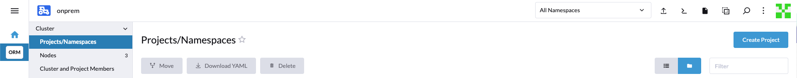

# 1) Logging into Rancher
Logins to Rancher are now managed by an Active Directory security group that is managed by CCAST Staff in [Grouper](https://grouper.it.ndsu.edu/grouper).  

For new users to be granted access to Rancher, please email ndsu.ccast.support@ndsu.edu

## Login to Rancher

Navigate out to [rancher.ccast.ndsu.edu](https://rancher.ccast.ndsu.edu/) 

You will see the following screen that asks you to login using Shibboleth. Click "Log in with Shibboleth" and then proceed to login using your NDSU credentials. 


Click on the ORM box on the left side column of the screen. You should now be viewing the Cluster Dashboard. 

Click on the dark page icon in the top right of the webpage. Hovering over it should display the text, "Download Kube Config" 


# 2) Todo API

The todo API is a toy example of a containerized workload that can be deployed locally as well as on Kubernetes

## Cloning the repository

Clone the repo at https://github.com/ccastndsu/todo-api.

`git clone https://github.com/ccastndsu/todo-api.git`

## Repository contents
The repository contains an example application that uses the FastAPI python framework and a PostgreSQL database to make a simple todo API, here are some of the highlights of the files that are important for the containerization of the application.

### Dockerfile
The Dockerfile is a very simple definition that copies the code into the container and sets up dependencies, working directory and run command. 
```
FROM python:3.11-slim
WORKDIR /app
COPY requirements.txt ./
RUN pip install --no-cache-dir -r requirements.txt
COPY . .
CMD ["uvicorn", "main:app", "--host", "0.0.0.0", "--port", "8000"] 
```

### docker-compose.yml
The docker-compose.yml file sets up two containers, the API and the database. There are environment variables passed to each container for database setup and credentials.

```
version: '3.8'
services:
  db:
    image: postgres:15
    environment:
      POSTGRES_USER: todo
      POSTGRES_PASSWORD: todo
      POSTGRES_DB: todo_db
    ports:
      - "5432:5432"
  api:
    build: .
    command: uvicorn main:app --host 0.0.0.0 --port 8000 --reload
    volumes:
      - .:/app
    ports:
      - "8000:8000"
    depends_on:
      - db
    environment:
      DATABASE_URL: postgresql+psycopg2://todo:todo@db:5432/todo_db
```

### database.py
The database.py file sets up the connection to the database for the API, the file is setup to take in environment variables to set the database connection and credentials.

```
...
DB_USER = os.getenv("username", "")
DB_PASS = os.getenv("password", "")
DB_HOST = os.getenv("host", "")
DB_PORT = os.getenv("port", "")
DB_DB = os.getenv("dbname", "")

KUBE_DATABASE_URL = f"postgresql+psycopg2://{DB_USER}:{DB_PASS}@{DB_HOST}:{DB_PORT}/{DB_DB}"
DATABASE_URL = os.getenv("DATABASE_URL", KUBE_DATABASE_URL)
...
```

The DB_* variables are auto-generated names that Kubernetes can provide which is why there is two ways to provide a database URL. This was a design choice for this API but not necessarily the way you would want to design this in production.

### main.py
The main.py file contains the logic and URL endpoints for interacting with the todo API.
```
...
def get_db():
    db = database.SessionLocal()
    try:
        yield db
    finally:
        db.close()
...

@app.post("/todos/", response_model=schemas.TodoOut)
def create_todo(todo: schemas.TodoCreate, db: Session = Depends(get_db)):
    ...

@app.get("/todos/", response_model=list[schemas.TodoOut])
def read_todos(skip: int = 0, limit: int = 100, db: Session = Depends(get_db)):
    ...

@app.get("/todos/{todo_id}", response_model=schemas.TodoOut)
def read_todo(todo_id: int, db: Session = Depends(get_db)):
    ...

@app.put("/todos/{todo_id}", response_model=schemas.TodoOut)
def update_todo(todo_id: int, todo: schemas.TodoUpdate, db: Session = Depends(get_db)):
    ...

@app.delete("/todos/{todo_id}")
def delete_todo(todo_id: int, db: Session = Depends(get_db)):
    ...
```

## Run the API with docker compose

1. Ensure you have cloned the API to your local system and have navigated to it.
2. Ensure you have Docker and docker-compose installed and ready on your system
    * The Podman equivalents could also work
3. Run the docker-compose command.
    * `docker-compose up --build`
4. Navigate to [http://localhost:8000](http://localhost:8000)
    * [http://localhost:8000/docs](http://localhost:8000/docs) contains an UI for interacting with the API

# 3) Deploying the todo API to the Kubernetes cluster

## Installing kubectl
Kubectl is the command line tool for interacting with any Kubernetes cluster. Please follow the official instructions for downloading and installing kubectl.
* [Linux](https://kubernetes.io/docs/tasks/tools/install-kubectl-linux/)
* [Mac](https://kubernetes.io/docs/tasks/tools/install-kubectl-macos/)
* [Windows](https://kubernetes.io/docs/tasks/tools/install-kubectl-windows/)

## Installing the Kubeconfig file
The kubeconfig file download from [Login to Rancher](#login-to-rancher) acts as the "password" to access the Cluster, kubectl must be told what kubeconfig file to use, you can either do this using CLI flags for each call, environment variables, or placing it in a specific location.

* CLI flag for each time you run: `kubectl \<command\> --kubeconfig /path/to/your/kubeconfig`
* Export env variable for your session: `export KUBECONFIG=/path/to/your/kubeconfig`
* Place the file at this location: `~/.kube/config`

## Creating a project and then a namespace

The first step to deploying any workflow is to create a project and then a namespace in Rancher.

Click on ORM in the left sidepanel. Then under Cluster, click Projects/Namespaces.



From there click Create Project in the top right of the screen. Proceed to give it any name and the other default values can remain unchanged.


Now that you have a created Project, you can create a namespace within that project. 
Click Create Namespace on your newly created Project. 


You have now successfully created yourself a working project and namespace environment that you will use for the rest of this demo. 

## Deploying yaml files
The yaml files in the [kubernetes folder](./kubernetes) are what equate to the docker compose file but for Kubernetes deployment.

1. Deploy the Postgres database.
    * `kubectl apply -f kubernetes/postgres-cluster.yaml -n <namespace>`
    * Wait for the cluster to become "Cluster in healthy state" `kubectl get --watch clusters.postgresql.cnpg.io -n <namespace>`
2. Deploy todo API
    * `kubectl apply -f kubernetes/deployment.yaml -n <namespace>`
3. Deploy service
    * `kubectl apply -f kubernetes/svc.yaml -n <namespace>`
4. Access the API
    * In a terminal port forward the service to your local machine.
    *  `kubectl port-forward -n <namespace> services/todo-api-svc 8000`
    * You should be able to access the API running in the kubernetes cluster at [http://localhost:8000/docs](http://localhost:8000/docs)

## Clean up yaml files and namespace

Once you are done cleaning up the demo is done using the `kubectl delete` command in the reverse order.

1. Delete the service
    * `kubectl delete -f kubernetes/svc.yaml -n <namespace>`
2. Delete the API
    * `kubectl delete -f kubernetes/deployment.yaml -n <namespace>`
3. Delete the Database
    * `kubectl delete -f kubernetes/postgres-cluster.yaml -n <namespace>`
4. Delete the namespace
    * `kubectl delete namespace <namespace>`
